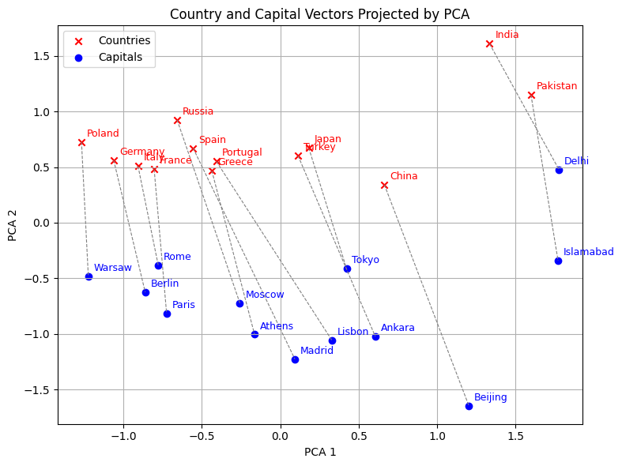
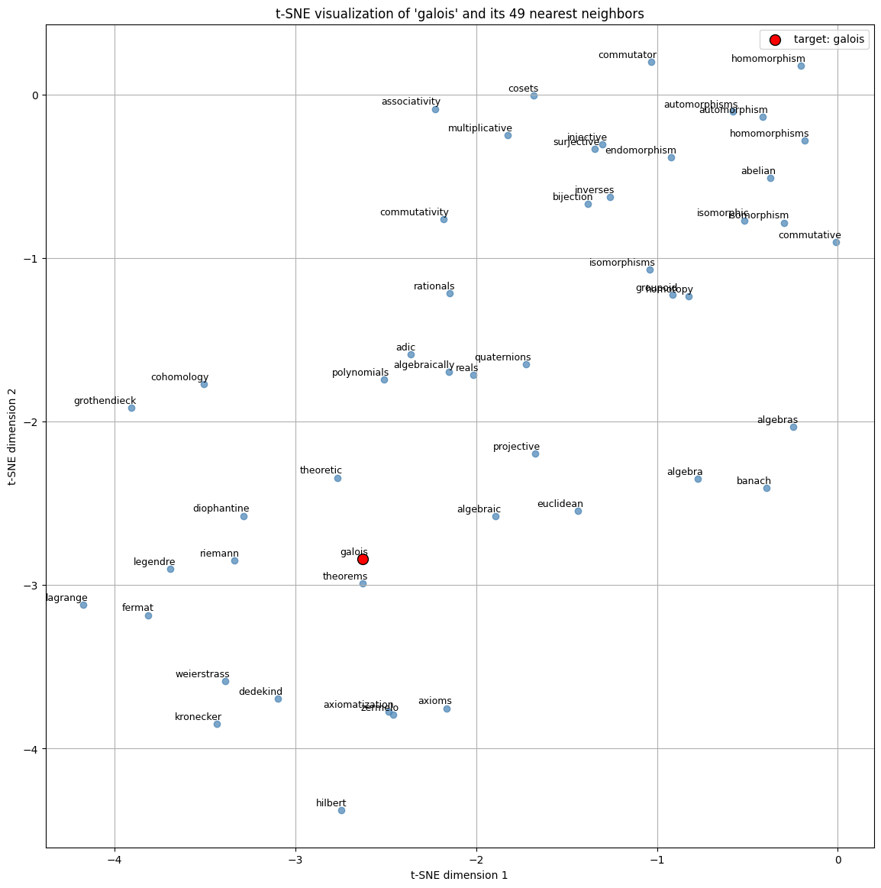

# Skip-gram with Negative Sampling

This project implements the **Skip-gram with Negative Sampling (SGNS)** model for learning word embeddings from the `text8` corpus, using PyTorch. The notebook emphasizes both the theoretical underpinnings of the model and the details of the negative sampling technique, with meticulous mathematical exposition. The embeddings are trained with early stopping rule based on the extrinsic scores from evaluation on WordSim353 and Google analogy test set. 

